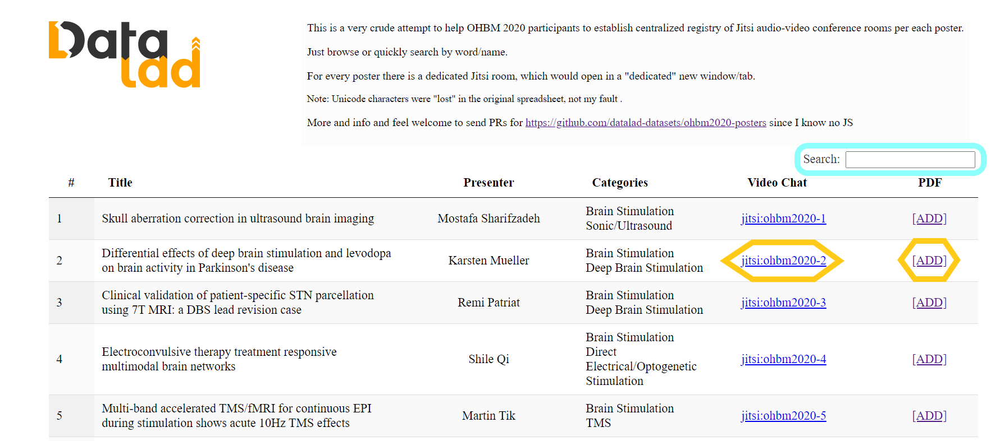
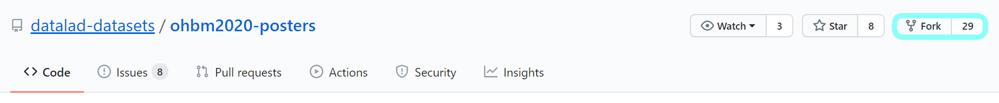
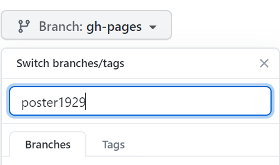
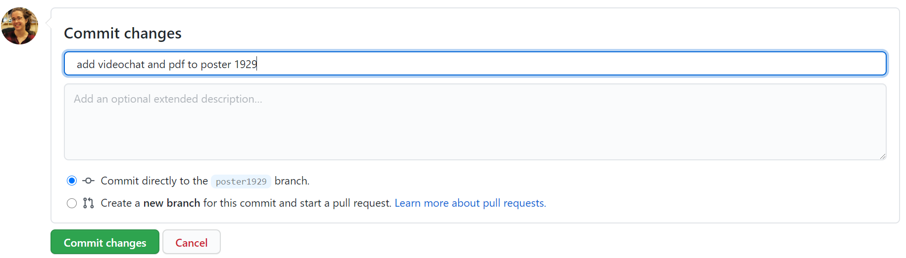
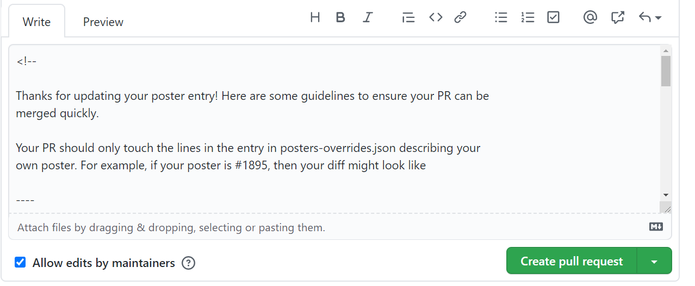

# :door::video_camera: OHBM2020 GallOP (Gallery of Open Presentations) platform
<!-- ALL-CONTRIBUTORS-BADGE:START - Do not remove or modify this section -->
[](#contributors-)
<!-- ALL-CONTRIBUTORS-BADGE:END -->

## :question: Motivation
<p align=justify>As much as we had fun preparing our <a href="https://ohbm.6connex.com/event/OHBMAnnualMeeting/en-us#!/CenterforOpenNeuroscience">Center of Open Neuroscience: DataLad, ReproNim, et al.</a> booth, experience with the conference platform quickly showed its shortcomings: poster sessions seemed to be limited to "open a PDF, find the presenter somewhere in an old fashioned chat and 'converse' there". It is not even 2010 -- it is more of 2000. There were discussions about
 establishing some <code>gather.town</code> room for poster presentations etc.</p>  
<p align=justify>Since there is a spreadsheet with all the posters, and unique IDs for each one (but unfortunately without PDF URLs to be added to git-annex/DataLad), we decided to (ab)use Jitsi to provide each poster with a dedicated video room.</p>
 
## :boom: What the Heck Is Jitsi?
<p align=justify>Jitsi is your free and open source Zoom, Google Meet, whatnot... But it is more than that -- it is a decentralized, and IIRC end-to-end encrypted video conferencing system. I believe it is used by the <code>gather.town</code> that many of you got to love. Discover more on <a href="https://en.wikipedia.org/wiki/Jitsi">wikipedia:Jitsi</a>.</p>

## :arrow_forward: Implementation
<p align=justify>This "website" is a crude lobotomization of what the basic DataLad datasets navigator <code>datalad create-sibling --with-ui</code> creates for you; <a href="https://datasets.datalad.org">https://datasets.datalad.org</a> is one of such websites.</p>
<p align=justify>Also, if you check the git history, you will see that we have used <a href="http://handbook.datalad.org/en/latest/basics/101-109-rerun.html">datalad run</a> to annotate how <code>posters.json</code> was produced. So you can use <code>datalad rerun _produce_posters.json</code> (where <code>_produce_posters.json</code> is just a git tag) to regenerate <code>posters.json</code> using either a modified script or the original <code>.tsv</code>.</p> 

## :computer: How to Guideline
### :heavy_check_mark: How to Visit the OHBM2020 Posters Jitsi Rooms? 
Go to our website: [https://datalad-datasets.github.io/ohbm2020-posters/](https://datalad-datasets.github.io/ohbm2020-posters/) & wait for the page to load.
<br><br>

<br><br>
:mag::eyes::door: 
1. **Searching for a poster**: Enter your desired keywords (Number ID, Title, Presenter, Category/ies) in the `Search` box, click on `Enter`, and the table will be limited to the results of your search. 
2. **Viewing a poster PDF**: Click on the `PDF` associated with the poster you would like to "present" or "attend". Each specific poster PDF would open in a new "dedicated" tab or window. Clicking on it again would just lead you to that tab/window if it was already open.
3. **Visiting a poster Jitsi room**: Click on the `jitsi:` associated with the poster you would like to "present" or "attend". Again, each specific poster Jitsi room would open in a new "dedicated" tab or window. Clicking on it again would just lead you to that tab/window if it was already open. Presenters can share their poster window by clicking on the `Share your screen` button in the bottom-left corner of the Jitsi room.

*Remark*: Unfortunately, the "source" spreadsheet neither had presentation dates/times, nor URLs to PDFs. So we might improve upon that (send a PR if you see how).

### :heavy_check_mark: How to Do a Pull Request? Adding Your Poster's Info to the Table

1. **GitHub account**: Create a [GitHub account](https://github.com) if you don’t already have one. As a student, you can apply for the [GitHub Student Developer Pack](https://help.github.com/en/github/teaching-and-learning-with-github-education/applying-for-a-student-developer-pack), which includes offers and benefits from GitHub partners.
2. **Forking**: Fork https://github.com/datalad-datasets/ohbm2020-posters to create a copy of the repository on your own GitHub account.
   * Click on `Fork` in the top-right corner of the page and choose to Fork a copy of the repository on your own GitHub account.
   * You will automatically go to that Fork.<br>
     
3. **Branching**: Within your Fork, create a Branch to add your poster's info to the table.
   * Click on `Branch: gh-pages` in the semi-top-left corner of the page and write the name of your new Branch (e.g. `poster1929`) in the white rectangle under `Switch branches/tags`. Click on `Enter`.    
   * You will automatically go to that Branch.<br>
     
4. **Editing**: Within your Branch, go to the `posters-overrides.json` file & click on the pencil :pencil2: in the top-right corner of the file to edit/add your poster's info (`Video Chat` and `PDF`) to the table.
   * Search for your poster's number (e.g. `"number": 1929`).
   * Which information to edit/add? 
     - The poster information from the OHBM's "source" spreadsheet (--> only if you want to edit an error in the "number", "title", "institution", "presenter", "categories", "authors", or "keywords" fields). You can check these fields in the [`posters.json`](./posters.json) file. Click on `View raw` & search for your poster's number.  
     - The poster Jitsi room's name & URL ("videochat" --> only if you want to edit the default Jitsi room's name & URL we've allocated to you: `jitsi:ohbm2020-POSTER_NUMBERID`).
     - An URL to your poster PDF ("pdf").
   * Copy those lines with the information you want to edit/add and paste them under your your poster's number. Do not forget to personalize the information after the colons! If you only want to add an URL to your poster PDF, you only need to copy-paste & personalize one line, i.e. the one starting with `"pdf"`.
   * Always put a comma after the previous line when adding a new one (except for the last line before `]` or `}`).
     ```json 
     {
      "number": 1929,
      "title": "The rsHRF toolbox (v2.2): Additional features and analyses, and extended user documentation",
      "institution": "Ghent University",
      "presenter": "Sofie Van Den Bossche",
      "categories": "Neuroinformatics and Data Sharing<br>Workflows",
      "videochat": "<a href=\"https://meet.jit.si/rsHRF_toolbox\" target=\"_rsHRF_toolbox\">jitsi:rsHRF_toolbox</a>",
      "pdf": "https://github.com/sofievdbos/OHBM2020/blob/master/OHBM20_SVDB_interactive.pdf",
      "authors": [
       "Sofie Van Den Bossche",
       "Guorong Wu",
       "Nigel Colenbier"
      ],
      "keywords": [
       "functional mri",
       "statistical methods",
       "workflows",
       "other - resting-state fmri; hemodynamic response function; toolbox; neuroinformatics"
      ]
     }
      ```
5. **Committing**: Commit your changes by clicking on the green `Commit changes` button. Do not forget to add a comment, e.g. `add videochat and pdf to poster 1929`.<br><br>
   
6. **PR**: Create a pull request (PR).
   * Within your Branch, click on the green `Compare & pull request` button.
   * You will be redirected to the main repository to confirm your PR. Check the remarks displayed in the `Write` section to make sure you haven't forgotten anything.
     Then, click on the green `Create pull request` button.<br><br>
     

## Installation

UI can be served directly on any static web servers such as nginx, apache, lite-server, or hosted services such as github pages, netlify, etc. `index.html` on gh-pages branch can be used as the entry point for the UI. `index.html` uses pre-built (webpacked) static content stored in `./static`

To run the dev instance of the UI, please install npm, then run `npm run install`, then launch the dev UI by running `npm run dev`.

The UI is currently hard-coded to use the test websocket backend server at `https://dev1.soichi.us/ohbm2020/`. If you'd like to run your own backend server, please run `backend/server.js`. You will normally want to persist this server via pm2, docker, or any other process management service. For example, if you want to use pm2, you can run

```
pm2 start backend/server.js --name gallop --watch
```

Server port number is currently hardcoded to 3000. Please adjust it if necessary. You can make this port accessible to all of your client instances, and/or you can proxy the server through your web server. For example, if you have nginx server running, you can expose the gallop server by adding something like the following.


```
    location /ohbm2020/ {
        proxy_pass http://localhost:3000/;
        proxy_http_version 1.1;
        proxy_set_header Upgrade $http_upgrade;
        proxy_set_header Connection "upgrade";
        proxy_set_header X-Real-IP $remote_addr;
        proxy_read_timeout 300s;
    }

```

## ✨ Contributors

Thanks goes to these wonderful people ([emoji key](https://allcontributors.org/docs/en/emoji-key)):

<!-- ALL-CONTRIBUTORS-LIST:START - Do not remove or modify this section -->
<!-- prettier-ignore-start -->
<!-- markdownlint-disable -->
<table>
  <tr>
    <td align="center"><a href="http://www.adina-wagner.com"><br /><sub><b>Adina Wagner</b></sub></a><br /><a href="#maintenance-adswa" title="Maintenance">🚧</a></td>
    <td align="center"><a href="https://github.com/bpoldrack"><br /><sub><b>Benjamin Poldrack</b></sub></a><br /><a href="https://github.com/datalad-datasets/ohbm2020-posters/commits?author=bpoldrack" title="Code">💻</a> <a href="#userTesting-bpoldrack" title="User Testing">📓</a></td>
    <td align="center"><a href="https://github.com/effigies"><br /><sub><b>Chris Markiewicz</b></sub></a><br /><a href="https://github.com/datalad-datasets/ohbm2020-posters/commits?author=effigies" title="Code">💻</a> <a href="#ideas-effigies" title="Ideas, Planning, & Feedback">🤔</a></td>
    <td align="center"><a href="https://github.com/christian-monch"><br /><sub><b>Christian Mönch</b></sub></a><br /><a href="https://github.com/datalad-datasets/ohbm2020-posters/commits?author=christian-monch" title="Code">💻</a> <a href="#maintenance-christian-monch" title="Maintenance">🚧</a></td>
    <td align="center"><a href="http://emdupre.me"><br /><sub><b>Elizabeth DuPre</b></sub></a><br /><a href="https://github.com/datalad-datasets/ohbm2020-posters/commits?author=emdupre" title="Code">💻</a> <a href="#ideas-emdupre" title="Ideas, Planning, & Feedback">🤔</a> <a href="#eventOrganizing-emdupre" title="Event Organizing">📋</a></td>
    <td align="center"><a href="http://neuroanatomy.github.io/"><br /><sub><b>Roberto Toro</b></sub></a><br /><a href="https://github.com/datalad-datasets/ohbm2020-posters/commits?author=r03ert0" title="Code">💻</a></td>
    <td align="center"><a href="http://rossmarkello.com"><br /><sub><b>Ross Markello</b></sub></a><br /><a href="https://github.com/datalad-datasets/ohbm2020-posters/commits?author=rmarkello" title="Code">💻</a> <a href="#ideas-rmarkello" title="Ideas, Planning, & Feedback">🤔</a></td>
  </tr>
  <tr>
    <td align="center"><a href="https://github.com/sofievdbos"><br /><sub><b>Sofie Van Den Bossche</b></sub></a><br /><a href="https://github.com/datalad-datasets/ohbm2020-posters/commits?author=sofievdbos" title="Documentation">📖</a> <a href="#example-sofievdbos" title="Examples">💡</a> <a href="#tutorial-sofievdbos" title="Tutorials">✅</a></td>
    <td align="center"><a href="http://soichi.us"><br /><sub><b>Soichi Hayashi</b></sub></a><br /><a href="https://github.com/datalad-datasets/ohbm2020-posters/commits?author=soichih" title="Code">💻</a> <a href="#design-soichih" title="Design">🎨</a> <a href="#ideas-soichih" title="Ideas, Planning, & Feedback">🤔</a> <a href="#maintenance-soichih" title="Maintenance">🚧</a> <a href="https://github.com/datalad-datasets/ohbm2020-posters/commits?author=soichih" title="Tests">⚠️</a></td>
    <td align="center"><a href="http://www.nisox.org"><br /><sub><b>Thomas Nichols</b></sub></a><br /><a href="https://github.com/datalad-datasets/ohbm2020-posters/commits?author=nicholst" title="Code">💻</a> <a href="#ideas-nicholst" title="Ideas, Planning, & Feedback">🤔</a></td>
    <td align="center"><a href="http://www.onerussian.com"><br /><sub><b>Yaroslav Halchenko</b></sub></a><br /><a href="https://github.com/datalad-datasets/ohbm2020-posters/commits?author=yarikoptic" title="Code">💻</a> <a href="#infra-yarikoptic" title="Infrastructure (Hosting, Build-Tools, etc)">🚇</a> <a href="#maintenance-yarikoptic" title="Maintenance">🚧</a> <a href="#ideas-yarikoptic" title="Ideas, Planning, & Feedback">🤔</a> <a href="#design-yarikoptic" title="Design">🎨</a> <a href="#projectManagement-yarikoptic" title="Project Management">📆</a> <a href="#talk-yarikoptic" title="Talks">📢</a></td>
  </tr>
</table>

<!-- markdownlint-enable -->
<!-- prettier-ignore-end -->
<!-- ALL-CONTRIBUTORS-LIST:END -->

This project follows the [all-contributors](https://github.com/all-contributors/all-contributors) specification. Contributions of any kind are welcome!
